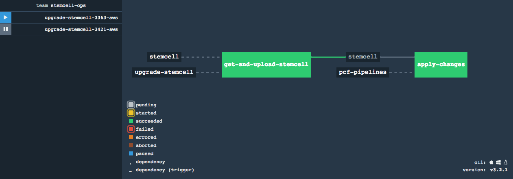

# concourse-upgrade-stemcell pipeline

This is a [Concourse](https://concourse.ci) pipeline for upgrading [Pivotal Cloud Foundry](https://pivotal.io/platform) stemcells via [PCF Ops Manager](https://network.pivotal.io/products/ops-manager).

**usage**

The pipeline tracks and updates a single stemcell major version for a single IaaS type. To track multiple stemcells / IaaS types, simply change `params.yml` and create a new pipeline for each major stemcell version / IaaS type.
